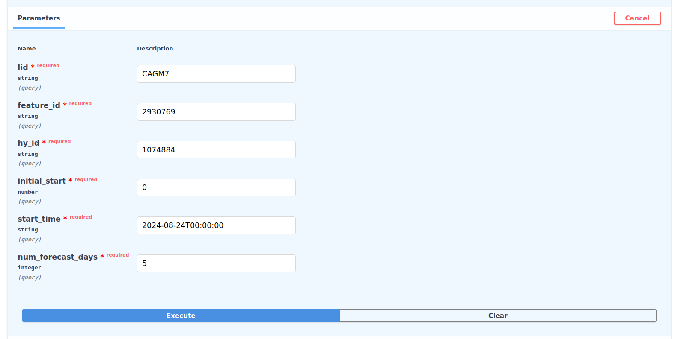

# T-Route FastAPI

The following doc is meant to explain the T-Route FastAPI implementation using docker compose and shared volumes. 

## Why an API?

T-Route is used in many contexts for hydrological river routing:
- NGEN 
- Scientific Python 
- Replace and Route (RnR)

In the latest PR for RnR, there is a requirement to run T-Route as a service. This service requires an easy way to dynamically create config files, restart flow from Initial Conditions, and run T-Route. To satisfy this requirement, a FastAPI endpoint was created in `/src/app` along with code to dynamically create t-route endpoints. 

## Why use shared volumes?

Since T-Route is running in a docker container, there has to be a connection between the directories on your machine and the directories within the container. We're sharing the following folders by default:
- `data/rfc_channel_forcings`
  - For storing RnR RFC channel domain forcing files (T-Route inputs)
- `data/rfc_geopackage_data`
  - For storing HYFeatures gpkg files 
  - Indexed by the NHD COMID, also called hf_id. Ex: 2930769 is the hf_id for the CAGM7 RFC forecast point. 
- `data/troute_restart`
  - For storing TRoute Restart files
- `data/troute_output`
  - For outputting results from the T-Route container

## Quickstart
1. From the Root directory, run:
```shell
docker compose up
```

This will start the T-Route container and run the API on localhost:8004. To view the API spec and swagger docs, visit localhost:8004/docs

2. Submit a request
```shell
curl -X 'GET' \
  'http://localhost:8004/api/v1/flow_routing/v4/?lid=CAGM7&feature_id=2930769&hy_id=1074884&initial_start=0&start_time=2024-08-24T00%3A00%3A00&num_forecast_days=5' \
  -H 'accept: application/json'
```

This curl command is pinging the flow_routing v4 endpoint `api/v1/flow_routing/v4/` with the following metadata:
```
lid=CAGM7
feature_id=2930769
hy_id=1074884
initial_start=0
start_time=2024-08-24T00:00:00
num_forecast_days=5
```

which informs T-Route which location folder to look at, what feature ID to read a gpkg from, the HY feature_id where flow is starting, the initial start flow for flow restart, start-time of the routing run, and the number of days to forecast. 

You can also run the following args from the swagger endpoint:



The result for a successful routing is a status 200:
```json
{
  "message": "T-Route run successfully",
  "lid": "CAGM7",
  "feature_id": "2930769"
}
```

and an internal 500 error if there is something wrong. 

## Building and pushing to a container registry

the `build.sh` script is created to simplify the process of pushing the T-route image to a docker container registry. Below is the URL for the pushed container:
```shell
ghcr.io/NOAA-OWP/t-route/t-route-api:${TAG}
```
To run that script, the following ENV variables have to be set:
- ${GH_USERNAME}
  - your github username
- ${GH_TOKEN}
  - your github access token
- ${TAG} 
  - the version tag
  - ex: 0.0.2

If you want to build this off a forked version, change the container registry to your user accounts container registry. 

## Testing:

To test this container, follow the steps within `test/api/README.md`